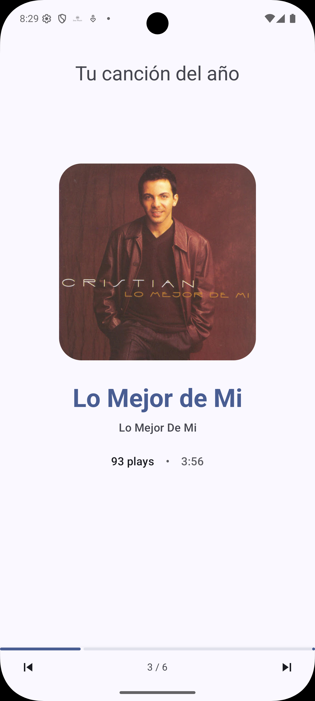
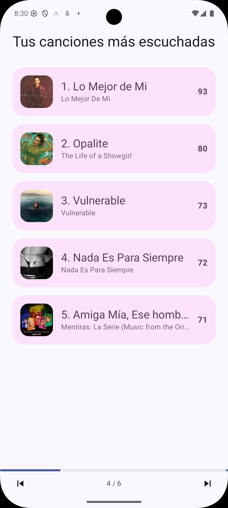
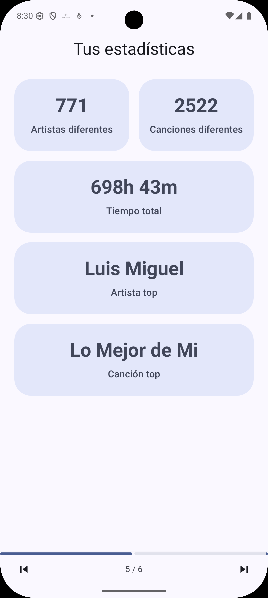
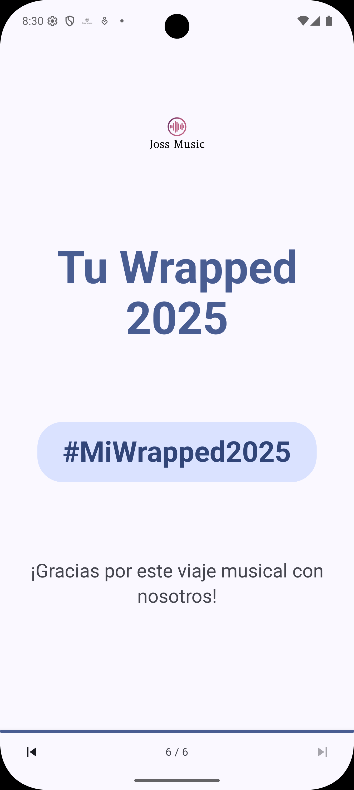

<div align="center">


<h1>Estrella Music v2</h1>

<p><strong>Cross-platform music streaming · Flutter · YouTube Music</strong></p>

<!-- Badges -->
<p>
  <a href="https://github.com/josprox/Estrella-Music/releases/latest">
    
  </a>
  <a href="https://github.com/josprox/Estrella-Music/releases/latest">
    
  </a>
  <a href="LICENSE">
    
  </a>
  
  
</p>

<!-- Download buttons -->
<p>
  <a href="https://github.com/josprox/Estrella-Music/releases/latest/download/EstrellaMusic-android-universal.apk">
    
  </a>
  <a href="https://github.com/josprox/Estrella-Music/releases/latest/download/EstrellaMusic-windows-installer.exe">
    
  </a>
  <a href="https://github.com/josprox/Estrella-Music/releases/latest/download/EstrellaMusic-linux-x64.tar.gz">
    
  </a>
  <a href="https://github.com/josprox/Estrella-Music/releases/latest/download/EstrellaMusic-macos.zip">
    
  </a>
</p>

</div>

---

## ✨ What is Estrella Music v2?

**Estrella Music v2** is the full Flutter evolution of the original Kotlin version. Built on top of a powerful engine and deeply integrated with the **YouTube Music** ecosystem, v2 brings a premium cross-platform experience to Android, Windows, Linux, macOS, and iOS — with cloud sync powered by **EMusic** and identity by **Joss Red**.

> **Migrate seamlessly** from your old `song.db` or `.backup` files. Your playlists, history, and favorites come with you.

---

## 🚀 Features

<table>
<tr>
<td width="50%">

### 🎵 Streaming & Playback
- Stream millions of songs, albums & playlists via YouTube Music
- High-quality audio with smart chunk caching
- Gapless playback & skip silence
- Background playback with native media controls
- Radio / continuous discovery mode

### 📜 Library & Discovery
- Local library management (songs, albums, artists)
- Synced & plain-text lyrics via **LRCLIB**
- Playlist import (YouTube Music, Piped)
- Persistent playback queue

</td>
<td width="50%">

### ☁️ Cloud & Sync *(EMusic)*
- Cloud library sync via **EMusic** server
- Offline downloads with authorized metadata
- Conflict-free incremental sync with queue
- Multi-device support with Joss Red identity

### 🖥️ Cross-Platform
- **Android** — Material 3 UI + Android Auto
- **Windows & Linux** — Desktop sidebar + tray
- **macOS** — Native macOS window management
- **iOS** — Unsigned IPA via SideStore

### 🔐 Auth & Updates
- Identity via **Joss Red** (JWT · profile · backups · friends)
- In-app updater with per-platform download & install
- Blocking update gate with world-class UI

</td>
</tr>
</table>

---

## 📸 Screenshots

<div align="center">
<p><em>Library, Wrap & Stats Screens (from the Kotlin version)</em></p>

<table>
  <tr>
    <td></td>
    <td></td>
    <td></td>
    <td></td>
    <td></td>
    <td></td>
  </tr>
</table>
</div>

---

## 🛠 Tech Stack

| Layer | Technology |
|---|---|
| **Framework** | [Flutter](https://flutter.dev) 3.x · Dart |
| **State** | [GetX](https://pub.dev/packages/get) |
| **Audio (Android/iOS)** | `just_audio` |
| **Audio (Desktop)** | `media_kit` via `just_audio_media_kit` |
| **Networking** | [Dio](https://pub.dev/packages/dio) · [YouTube Explode](https://pub.dev/packages/youtube_explode_dart) |
| **Database** | SQLite (`sqlite3`) with legacy Hive migration |
| **Auth & Identity** | Joss Red (JWT · profile · backups · friends) |
| **Cloud Music** | EMusic (playlists · sync · offline · history) |
| **Notifications** | `flutter_local_notifications` · Firebase Messaging |
| **Build & Release** | GitHub Actions — multi-platform · draft releases |

---

## 📥 Installation

### Android / Windows / Linux / macOS

Download the latest release for your platform:

| Platform | File | Notes |
|---|---|---|
| 🤖 **Android** | `EstrellaMusic-android-universal.apk` | Universal APK — also available split by ABI |
| 🪟 **Windows** | `EstrellaMusic-windows-installer.exe` | Inno Setup installer |
| 🐧 **Linux** | `EstrellaMusic-linux-x64.tar.gz` | Requires `libmpv` + `libgtk-3` |
| 🍎 **macOS** | `EstrellaMusic-macos.zip` | Extract & drag to Applications. If Gatekeeper blocks it: **right-click → Open** |
| 🐙 **All** | [GitHub Releases →](https://github.com/josprox/Estrella-Music/releases/latest) | |

> The in-app updater will notify you and handle download + installation automatically on Android and Windows.

---

### 🍏 iPhone / iOS — Automatic Signing with SideStore

To install the `.ipa` without the signature expiring after 7 days:

1. **Install SideStore** by following the official guide at [sidestore.io](https://sidestore.io) (requires initial computer setup + internal WireGuard VPN).
2. **Configure EMusic Anisette Server:**
   - SideStore → **Settings** → **Anisette Server URL**
   - Replace with: `https://emusic.joss.red/api/anisette`
   - Log in with your Apple ID inside SideStore.
3. **Install the App:**
   - Download `EstrellaMusic-ios-unsigned.ipa` on your iPhone → **Files**.
   - SideStore → **My Apps** → **`+`** → select the `.ipa` file.
4. **Auto-renewal:** Open SideStore on Wi-Fi once a week and the signatures will renew in the background.

---

### 🧑‍💻 Build from source

```bash
# 1. Clone
git clone https://github.com/josprox/Estrella-Music.git
cd Estrella-Music

# 2. Environment
cp .env.example .env
# Edit .env — set API_URL, ONESIGNAL_APP_ID, UPDATE_CHECK_URL

# 3. Dependencies
flutter pub get

# 4. Run
flutter run
```

---

## ☁️ Architecture — Joss Ecosystem

```
┌────────────────────┐     JWT      ┌──────────────────┐
│   Estrella Music   │ ──────────► │    Joss Red      │
│  (Flutter Client)  │             │  Identity · Auth  │
│                    │             │  Profile · Backup │
│  Local cache       │             └──────────────────┘
│  Offline playback  │
│  Smart sync queue  │    Music     ┌──────────────────┐
│                    │ ──────────► │     EMusic       │
└────────────────────┘             │  Playlists · Sync │
                                   │  History · Cloud  │
                                   └──────────────────┘
```

- **Joss Red** — source of truth for users, sessions, JWT, profile, friends and backups.
- **EMusic** — specialized music cloud service (library, playlists, favorites, offline metadata, sync).
- **Flutter app** — primary client that works fully offline and syncs when connected.

---

## 📜 License & Authorship

**Copyright © 2026 Joss Estrada (JOSPROX). All rights reserved.**

Licensed under the **[GNU General Public License v3.0](LICENSE)**.

- You may not use modified versions for non-free or commercial purposes.
- You may not publish modified versions on closed-source stores (Google Play, App Store).
- See [CREDITS.md](CREDITS.md) for full third-party acknowledgments.

*This project is not affiliated with, funded, authorized, or endorsed by Google LLC or YouTube. All trademarks belong to their respective owners.*

---

## 📈 Growth

[](https://star-history.com/#josprox/Estrella-Music&Date)

---

<div align="center">

[](https://deepwiki.com/josprox/Estrella-Music)

Made with ❤️ by **[JOSPROX](https://github.com/josprox)**

</div>
