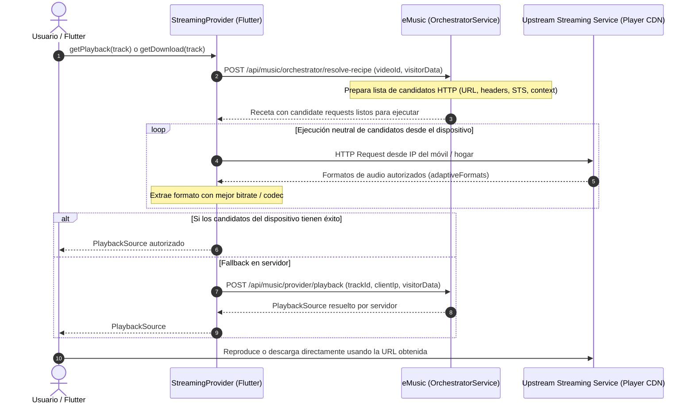

# Prueba E2E de eMusic y Flujo de Orquestación Neutral

Este documento describe la arquitectura, flujo de resolución y verificación del servicio de streaming y catálogo entre la aplicación Flutter, el backend eMusic y los servicios upstream.

---

## 1. Arquitectura de Resolución Neutral Basada en Receta

Para garantizar que el streaming externo resuelva URLs válidas sin verse afectado por bloqueos de IPs de servidores/datacenters ni violar la neutralidad de la app Flutter, se implementa el siguiente flujo de orquestación neutral:



---

## 2. Responsabilidades y Separación de Capas

### Flutter (`StreamingProvider`)
- **Neutralidad absoluta**: Flutter **no** contiene dominios hardcodeados, nombres de clientes de YouTube (`VISIONOS`, `IOS`, etc.), cálculo de firmas (`STS`), ni lógica de botguard.
- **Ejecución neutral de receta**:
  - Solicita a EMusic la receta preparada para el `videoId`.
  - Recibe especificaciones HTTP genéricas (`url`, `method`, `headers`, `body`, `playbackHeaders`).
  - Ejecuta las peticiones directamente desde la conexión del dispositivo (IP residencial/móvil) evitando filtros de datacenter.
  - Extrae genéricamente el mejor stream de audio según el `bitrate` y el contenedor solicitado.
  - Si la resolución directa en el dispositivo no está disponible o falla, realiza un **fallback transparente al servidor** (`POST /api/music/provider/playback`).
- **Resolución perezosa de IP (`PublicIpResolver`)**:
  - Consulta un endpoint HTTPS genérico (`https://api.ipify.org?format=json`) con timeout de 5s y caché en memoria de 10 min.
  - Valida IPv4 / IPv6 descartando privadas y loopback.
  - Envía `clientIp` al servidor cuando se requiere resolución en fallback.

### eMusic Backend (`OrchestratorService.joss`)
- **Generación de Recetas Preparadas (`getRecipeForVideo`)**:
  - Precalcula `STS` global, `visitorData` y prepara el cuerpo JSON y cabeceras exactas para cada cliente del pipeline.
  - Entrega a Flutter la lista `candidates` lista para ser ejecutada.
- **Validación y Sanitización en Fallback (`validateClientIp`)**:
  - Previene inyección de cabeceras HTTP rechazando comas, saltos de línea (`\r`, `\n`) y listas de IPs.
  - Descarte de direcciones privadas y loopback antes de aplicar `X-Forwarded-For`.
  - Aislamiento de caché en servidor `stream_res_{videoId}_{validClientIp ?? "none"}`.
- **Sin proxy de audio**:
  - eMusic nunca transmite los bytes de audio; los streams viajan directamente entre el dispositivo del usuario y el CDN de entrega.

---

## 3. Diagnóstico y Manejo de Errores

| Tipo de Error | Causa Raíz | Comportamiento Esperado |
| :--- | :--- | :--- |
| **`LOGIN_REQUIRED` en servidor** | El upstream bloquea peticiones originadas en la IP de datacenter del servidor. | Flutter resuelve directamente desde la IP del móvil vía receta preparada sin bloqueo. |
| **Fallo al obtener IP pública** | Sin conexión externa a ipify o timeout. | `PublicIpResolver` retorna `null`, loguea diagnóstico enmascarado y el provider continúa sin `clientIp`. |
| **Rechazo 401 / 403** | Token de sesión Joss Red vencido o URL expirada. | `StreamingProvider` reporta `MusicProviderException` e invalida el caché de la fuente. |
| **Fallo de red Flutter <-> eMusic** | Servidor eMusic apagado o inalcanzable. | Flutter mantiene la biblioteca local y el modo offline funcional sin crasheos. |

---

## 4. Ejecución de la Prueba E2E Automática

Para ejecutar el script de verificación contra un servidor eMusic en ejecución:

```powershell
# 1. Asegurar que Joss Red y EMusic estén iniciados
# 2. Ejecutar la suite E2E de catálogo y playback:
python scripts/test_emusic_server.py
```
